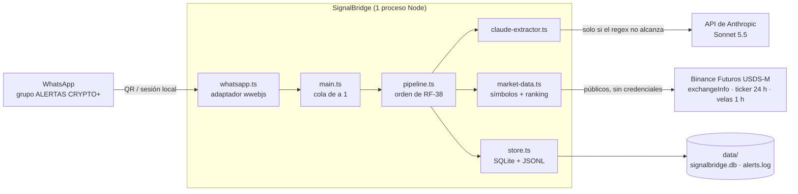
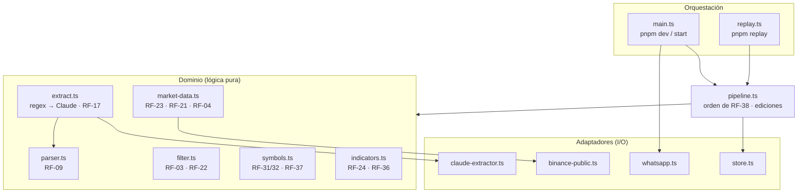
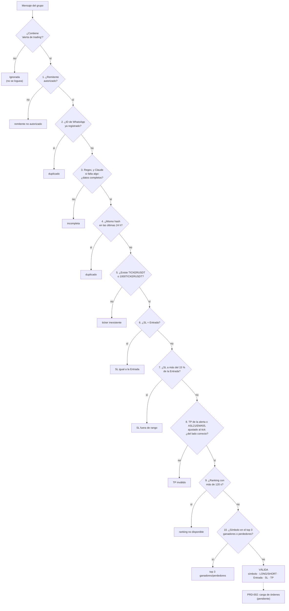
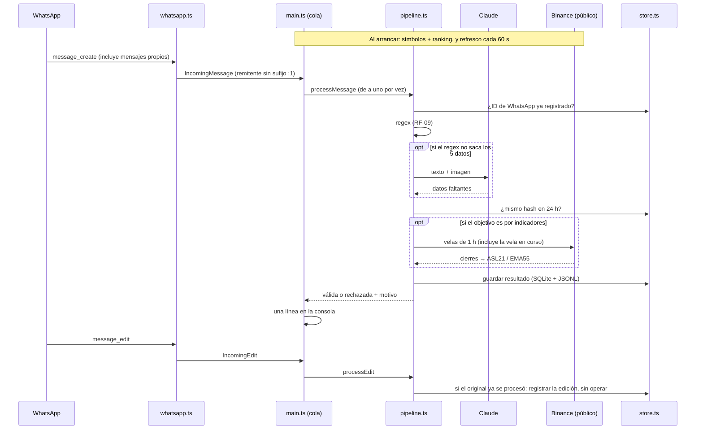

# Arquitectura de SignalBridge

Estado: ingesta y validación de alertas ([PRD-001](prd/PRD-001-ingesta-validacion.md)) implementadas
y probadas en vivo en modo DRY. La carga de órdenes ([PRD-002](prd/PRD-002-carga-reversion.md)) y el
seguimiento ([PRD-003](prd/PRD-003-seguimiento-cierre.md)) todavía no están implementados.

## 1. Contexto

Un único proceso Node lee el grupo de WhatsApp, valida cada alerta y la deja válida o rechazada con
un motivo. Habla con tres servicios externos y guarda todo en disco local.



Idea guía: todo lo que habla con el exterior (WhatsApp, Binance, Claude, disco) es un **adaptador**
chico, y las reglas del PRD viven en **funciones puras** que no saben de dónde viene el dato. Así los
tests cubren cada criterio de aceptación sin red ni cuentas, en pocos segundos.

## 2. Módulos



| Módulo | Responsabilidad |
|---|---|
| `filter.ts` | Disparador "alerta de trading" sin mayúsculas ni tildes (RF-03) y remitentes autorizados (RF-22). |
| `parser.ts` | Extrae ticker, Entrada, objetivo, SL y riesgo con regex (RF-09). Devuelve lo que pudo sacar. |
| `claude-extractor.ts` | Respaldo con Claude Sonnet 5.5 y salida estructurada; completa solo los datos que faltan (RF-16). |
| `extract.ts` | Orquesta regex → Claude y decide "incompleta" (RF-17). Lo que saca el regex siempre manda. |
| `symbols.ts` | `TICKERUSDT` o `1000TICKERUSDT` (RF-31/32) y redondeo al tickSize (RF-37). |
| `indicators.ts` | EMA y WMA como en TradingView; TP por ASL21/EMA55 (RF-24/36). |
| `market-data.ts` | Copia local de símbolos y ranking top 3, refrescada cada 60 s (RF-23/21/04). |
| `store.ts` | Duplicados (RF-11/29), log de alertas (RF-05) y ediciones. |
| `pipeline.ts` | Aplica las validaciones en el orden de RF-38 y registra solo el primer motivo. |
| `whatsapp.ts` | QR, búsqueda del grupo, mensajes nuevos y ediciones. |
| `replay.ts` | Pasa capturas reales por el mismo pipeline, sin WhatsApp y con base en memoria. |

`main.ts` y `replay.ts` usan **el mismo pipeline**; solo cambia de dónde vienen los mensajes. Por eso
el replay prueba lo mismo que corre en vivo.

## 3. Flujo de una alerta



Cada resultado, válido o rechazado con su primer motivo, queda en SQLite y en `data/alerts.log`.

## 4. Secuencia en vivo



## 5. Datos

```text
data/                      (0700)
├── signalbridge.db        (0600)  SQLite
│     alerts(alert_id, wa_message_id, content_hash, received_at, status, reason, record JSON)
│     edits (alert_id, wa_message_id, edited_at, record JSON)
└── alerts.log             (0600)  una línea JSON por alerta o edición (tail -f, jq)
```

- `alert_id` = `<ID de WhatsApp>:<hash de 16 hex>` (RF-11).
- El hash usa `(ticker, Entrada, SL, TP)` tal como vienen en la alerta. Si el objetivo es por
  indicadores, entra como `"indicadores"` y no como el TP calculado.

## 6. Decisiones

| Decisión | Por qué |
|---|---|
| Regex primero, Claude solo de respaldo | Las 33 alertas reales capturadas parsean con regex en ~1 ms, gratis y sin variabilidad. Claude es más lento, cuesta y necesita API key. |
| Funciones puras + adaptadores | Las reglas del PRD se prueban sin WhatsApp, Binance ni Claude; los adaptadores se reemplazan por fakes. |
| Endpoints públicos de Binance con `fetch` | PRD-001 solo lee datos públicos sin credenciales (AC-30). CCXT entra con PRD-002, para operar. |
| Copia local de símbolos y ranking cada 60 s | Validar no espera a Binance (RNF-01). Si un refresco falla se conserva la copia anterior; RF-21 controla la antigüedad. |
| Velas solo si el TP es por indicadores | RF-24 pide la vela en curso; si la alerta trae precio, no se piden (AC-34). |
| Hash con el TP de la alerta | El TP calculado cambia con cada vela y un reenvío no se detectaría como duplicado. |
| Cola de a un mensaje por vez | Dos reenvíos simultáneos no pueden pasar juntos el control de duplicados. |
| SQLite (`node:sqlite`) + JSONL | SQLite para consultar duplicados sin dependencias extra; JSONL para auditar a ojo. |
| `umask 077` y permisos 0700/0600 | RNF-10: todo lo que crea el proceso lo lee solo su usuario. |
| Solo mensajes nuevos, sin releer el historial | Al reiniciar no se operan alertas viejas; RF-29 cubre los reenvíos. |
| `message_create` y remitente sin `:1` | Permite probar con mensajes propios, y el ID es el mismo desde cualquier dispositivo. |
| Búsqueda del grupo con `evaluate` | `getChats()` y `getChatById()` fallan con "r: r" en este grupo (visto en la v1). |
| SL a más del 15 % se rechaza (RF-50) | Ataja typos como AXS (Entrada 1.246, SL 0.1222). La alerta legítima más lejana estaba a 5,88 %. |
| Ediciones: se registran, no se operan | Gestionar una alerta ya procesada está fuera de alcance (PRD-000); queda para revisión manual. |
| Ante la duda, rechazar | Si Claude falla o se niega, si fallan las velas o si el ranking es viejo, la alerta se rechaza con motivo. |

## 7. Pendientes

- Descarga de imágenes de WhatsApp: `downloadMedia` falla con "r", así que el respaldo por imagen
  (RF-16) todavía no recibe imagen. Después se evalúa llamar a Claude en dos pasos (primero texto,
  después imagen).
- Cifrado de la sesión de WhatsApp (RNF-03): requisito antes de habilitar LIVE.
- Reconexión con backoff (RNF-04) y reinicio automático con systemd (RNF-05).
- Carga de órdenes en Binance (PRD-002) y seguimiento y cierre (PRD-003).
